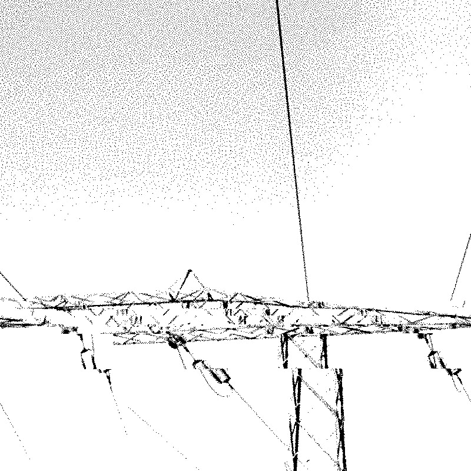
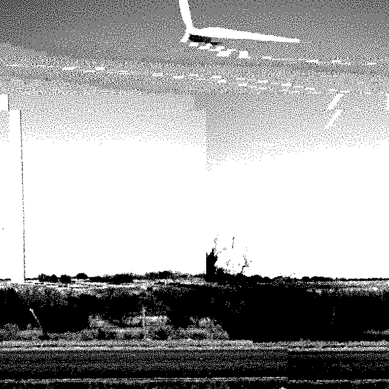

{:style="display:block; margin-left:auto; margin-right:auto"}{: width="350" }{: height="350" }

<h3> 
 Living in a simulation? Cybernetic promises and data challenges of digital twins to decarbonise energy systems 
 </h3> 

Decarbonising energy systems by 2050 presents multiple dilemmas between national security, affordability, public support, and health. What if we could model these dilemmas and better anticipate sociotechnical impacts of building a new nuclear station, installation of solar panels on every roofs, or a change in energy tariffs? Digital twins--advanced virtual representations of social and physical processes and objects--promise to achieve that. However, as digital twins are still in the ‘demonstrator’ stage, many questions arise with regards to data accuracy, security; required expertise, and, most importantly, the epistemic foundations of claims made by models, predictions and resulting policy recommendations. This project investigated the sites of knowledge production related to digital twins in the context of energy systems, asking the following questions:
<ul>
  <li>Cybernetic promises: Which futures are afforded through digital twins’ outputs? What do these futures exclude or assume?</li>
  <li>Data challenges: What are potential security and privacy risks associated with digital twins and how to manage them?</li>
</ul>

  
<strong>[Read more]</strong>

  

  
<strong>Main findings:</strong>

   

  

  ***

<strong>Project team:</strong> Dr Ola Michalec (Fellow)

  

  ***

<strong>Outputs:</strong>

<ul>
  <li><strong>Peer-reviewed journal article:</strong> "“Models vs infrastructures? On the role of digital twins’ hype in anticipating the governance of the UK energy industry”. In Environmental Science and Policy (Special Issue on twin transitions). 2025. By Michalec, O.". <a href="https://doi.org/10.1016/j.envsci.2025.104041">Full text</a></li>
</ul>

  

  

  {:style="display:block; margin-left:auto; margin-right:auto"}{: width="350" }{: height="350" }

  <h3> 
 Hype Studies Group 
 </h3> 

[Hype Studies](https://hypestudies.org/) is an emergent, transdisciplinary research area aimed to investigate hype as a powerful and pervasive phenomenon that influences economic trends, political agendas, media narratives, and technological developments. We are a group of researchers and designers exploring how hype is a thing that does things. As a force composing and affecting attention, markets, politics, feelings, imagination, matter and knowledge, time and space. The Hype Studies group will be sharing resources and organising events to collectively understand and intervene into hype and its politics.

Join us to the inaugural [conference](https://hypestudies.org/conference) at the Universitat Oberta de Catalunya 10-12th September 2025 (hybrid attendance available). We hope that the conference will attract researchers interested in how energy innovations suceed or fail. In the age of noise and careless promises, how can we better evaluate hype related to 'sustainable' technologies?

  

   
<strong>[Read more]</strong>

  

  
<strong>Conference:</strong>

  
<strong>Commissioned artwork</strong>

  
