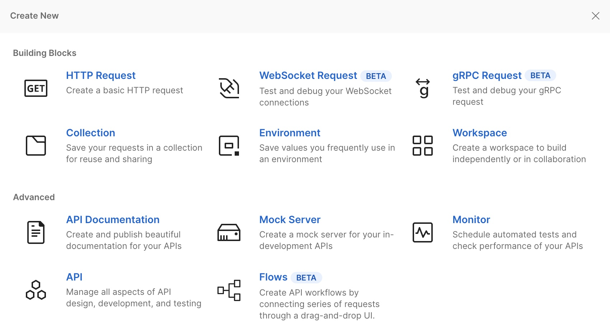
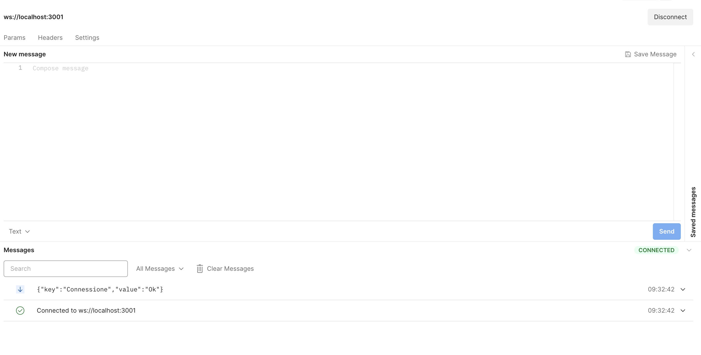

In questo POST analizziamo la possibilità di creare una piccola architettura **Event Driven** per sviluppare sistemi che operano in tempo reale utilizzando i [WebSocket](https://it.wikipedia.org/wiki/WebSocket).

I WebSocket permettono di creare una connessione persistente su cui inviare piccoli blocchi di dati bi-direzionale. Sviluppare un applicazione con WebSocket è abbastanza semplice grazie alle [API WebSocket](https://caniuse.com/websockets) integrate in tutti i browser moderni.

Invece con NodeJS e la libreria [WS](https://github.com/websockets/ws) possiamo sviluppare il server che dovrà gestire le molte connessioni contemporaneamente.

## WebSockets Server

Il Server è anche un API REST che inoltrerà a tutti i client connessi.
Cominciamo a creare la cartella del nostro server Nodejs:

```bash
mkdir ws-server
cd ws-server 
npm init

```

Creare il seguente file *package.json*

```json
{
  "name": "backend-events",
  "version": "1.0.0",
  "description": "",
  "main": "index.js",
  "scripts": {
    "start": "node dist/server.js",
    "dev": "babel-node src/server.js",
    "build": "babel src -d dist",
    "postinstall": "npm run build"
  },
  "author": "",
  "license": "ISC",
  "dependencies": {
    "@fastify/cors": "^8.0.0",
    "@fastify/websocket": "^6.0.1",
    "fastify": "^4.2.1",
    "fastify-socket.io": "^4.0.0",
    "socket.io": "^4.5.1",
    "ws": "^8.8.0"
  },
  "devDependencies": {
    "babel-cli": "^6.26.0",
    "babel-preset-es2015": "^6.24.1",
    "babel-preset-stage-2": "^6.24.1",
    "babel-register": "^6.26.0"
  }
}

```

Non ci resta che installare tutti i pacchetti con `npm install`.
E' il momento di scrivere il file nella cartella *server.js*, prima di farlo è necessario creare la cartella *src*:

```bash
mkdir ./ws-server/src
```

Copiate nel file *src/server.js* il seguente script:

```javascript
import WebSocket, { WebSocketServer } from 'ws';
import http from 'http';

const _PORT_ = 3002; 
const _PORT_WS_ = 3001; 
const _SERVER_ = 'localhost';

/** CORS */
const headers = {
  "Access-Control-Allow-Origin": "*",
  "Access-Control-Allow-Methods": "OPTIONS, POST, GET",
  "Access-Control-Max-Age": 2592000,                      // 30 days
  "Content-Type": "application/json"
  /** add other headers as per requirement */
};

/** create websocket server */
const wss = new WebSocketServer({ port: _PORT_WS_ });
console.log(`Server WebSocket running at ${_SERVER_}:${_PORT_WS_}/`);

wss.on('connection', function connection(ws) {
  ws.on('message', function message(data) {
    console.log('received: %s', data);
  });
  ws.send(JSON.stringify({ "key": "Connessione", "value": "Ok"}));
});

/** APi REST POST /event */
http.createServer((req, res) => {

  const { method, url } = req;
  
  if (url === "/event" && method === "POST") {

    let body = [];

    req.on('data', (chunk) => {
      body.push(chunk);
    }).on('end', () => {
      body = Buffer.concat(body).toString();

      // response headers
      res.writeHead(200, headers);

      wss.clients.forEach(function each(client) {
        if (client.readyState === WebSocket.OPEN) {
            /** send to clients payload */
          client.send(body);
        }
      });

      // set the response
      res.write(body);
      // end the response
      res.end();
    });
  } else {
    res.writeHead(404, headers);
    res.end(JSON.stringify({ message: "Route not found" }));
  }
}).listen(_PORT_, _SERVER_)

console.log(`Server running at ${_SERVER_}:${_PORT_}/`);
```

Ora avviamo il server e facciamo la nostra prima prova di invio di messaggio a tutti i client che si connetteranno al server websocket.

```bash
npm run build 
npm start
```

`http://localhost:3001`sarà il WebSocket Server a cui si dovranno connettere tutti i client, mentre `http://localhost:3002`è il server NodeJS per inviare i messaggi ai client connessi.

Usiamo PostMap per creare una connessione WebSocket client con il server:





Ad esempio per inviare un messaggio JSON a tutti i client si chiama l'EndPoint */event*:

```bash

curl --location --request POST 'http://localhost:3002/events' \
--header 'Content-Type: application/json' \
--data-raw '{
    "key": "hello",
    "value": "world"
}'

```

## Angular WebSocket Client

Per il client possiamo implentare un servizio WebSocket in un'applicazione Angular per ascoltare i messaggi inviati dal server ed eseguire funzioni.

Scriviamo un servizio dedicato **websockect.service.js** come segue:

```typescript

import { Injectable } from "@angular/core";
import { Observable, Observer } from 'rxjs';
import { AnonymousSubject } from 'rxjs/internal/Subject';
import { Subject } from 'rxjs';
import { map } from 'rxjs/operators';

export interface Message {
    source: string;
    content: string;
}

@Injectable()
export class WebsocketService {
    private subject!: AnonymousSubject<MessageEvent>;
    public messages: Subject<Message>;

    private _ws_url: string = 'ws://localhost:3001';

    constructor() {
        this.messages = <Subject<Message>>this.connect(this._ws_url).pipe(
            map((response: MessageEvent): Message => { return response.data; })
        );
    }

    /** connect to websocket server */
    public connect(url: string): AnonymousSubject<MessageEvent> {
        if (!this.subject) {
            this.subject = this.create(url);
        }
        return this.subject;
    }

    /** create observable websocket */
    private create(url: string): AnonymousSubject<MessageEvent> {
        let ws = new WebSocket(url);

        return new AnonymousSubject<MessageEvent>({
            error: (err: any) => {},
            complete: () => {},
            next: (data: Object) => {
                if (ws.readyState === WebSocket.OPEN) {
                    ws.send(JSON.stringify(data));
                }
            }
        }, new Observable((obs: Observer<MessageEvent>) => {
            ws.onmessage = obs.next.bind(obs);
            ws.onerror = obs.error.bind(obs);
            ws.onclose = obs.complete.bind(obs);
            return ws.close.bind(ws);
        }));
    }
}

```

Infine aggiungiamo ad un Componente Angular l'istanza del servizio per ascoltare i messaggi ricevuti dal server:

```typescript
import { Component, OnInit, ViewChild, OnDestroy, Input } from '@angular/core';
import { WebsocketService } from "../websocket.service";

@Component({
  selector: 'hx-badge',
  templateUrl: './badge.html',
  styleUrls: ['./badge.scss']
})
export class WSClientComponent implements OnInit, OnDestroy {

  constructor(private ws: WebsocketService) { }

  ngOnInit(): void {

    this.ws.messages.subscribe((msg: any) => {
      console.log("Response from websocket: " + msg);
      try {
        let m = JSON.parse(msg);
        console.log(JSON.stringify(m));
      } catch (error) {
        console.error(error)
      }
      
    });

  }
}
```

In questo POST ho analizzato la possibilità di creare una piccola architettura **Event Driven** per sviluppare sistemi che operano in tempo reale.  