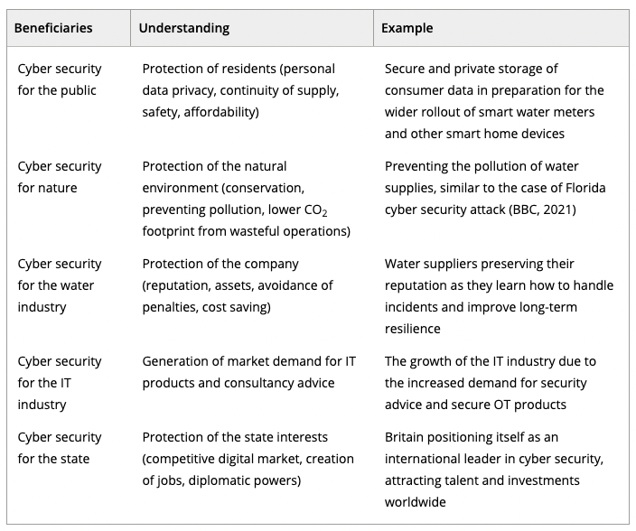

{:style="display:block; margin-left:auto; margin-right:auto"}{: width="350" }{: height="350" }

### How many shades of NIS? Understanding organisational cultures and sectoral differences during cyber security policy implementation

The project developed an empirically-grounded understanding of the role and impact of organisational cybersecurity cultures and practices across essential infrastructure sectors on the UK’s implementation of the Network and Information Systems (NIS) Regulations. We uncovered organisational and sectoral differences, for instance, in the ways which people work, what technologies (software/hardware) are relied upon, what additional compliance requirements exist. This yielded key insights about the NIS objectives that are already achieved, the ones difficult to effectively realise and potential blind spots arising from organisational cultures and sectoral practices. 

**Main Findings:**

* In ["When the future meets the past: can safety and cyber security coexist in modern critical infrastructures?"]((https://doi.org/10.1177/20539517221108369)), we argue that the implementation of Network and Information Systems Security Directive is the first step in the integration of safety and security through novel risk management practices. Therefore, it is the move towards legitimising the modernisation of critical infrastructures. But we also show that security risk management practices cannot be directly transplanted from the safety realm, as cyber security is grounded in anticipation of the future adversarial behaviours rather than the history of equipment failure rates.
* We present our argument in four parts. First, by establishing that safety-security integration was key for engineers accepting the modernisation agenda. Second, by outlining collective risk management practices that enabled diverse practitioners to collaborate (risk thinking hivemind, diversity in expertise, trust in collaborations). Third, by highlighting how practitioners borrowed elements from safety culture and incorporated it to security (harmonised threat and incident reporting, maintenance contracts). Fourth, by cautioning that epistemic and material differences between the old world of legacy technologies and novel big data tools pose limits to the future of critical infrastructures modernisation (namely, engineers trained to reason in prescriptive terms, secrecy in cyber, differing logics of risk assessment between safety and security professions).

* In ["Reconfiguring governance: How cyber security regulations are reconfiguring water governance"](https://doi.org/10.1111/rego.12423), we argue that the Network and Information Systems Regulations acts as a boundary object that gathers diverse communities of practice without the need to establish common goals.

{:style="display:block; margin-left:auto; margin-right:auto"}{: width="350" }{: height="350" }
  
Further, in the process of transposing the EU NIS Directive into the sectoral and national context, NIS requires interpretation by diverse expert communities. We show how translating the regulatory scope to the sectoral landscape involves prioritising some water governance goals over others. As expert communities converge in their collaboration practices, their priorities align or stand in tension with public interests. We argue that cyber security regulations have potential to reconfigure water governance by refocusing strategic priorities away from traditional concerns of environmental governance. 

{:style="display:block; margin-left:auto; margin-right:auto"}{: width="350" }{: height="350" }

We suggest ways to maintain diverse collaborations across engineering, computing, and water expertise that Network and Information Systems implementation remains aligned with the goals of water governance.

{:style="display:block; margin-left:auto; margin-right:auto"}{: width="350" }{: height="350" }

**Policy Recommendations:**

**Project team:** Prof. Awais Rashid (PI), Dr Dirk van der Linden (Co-I), Dr Sveta Milyaeva (Co-I), Dr Ola Michalec (PDRA). We were funded by the Research Institute in Trustworthy Inter-connected Cyber-Physical Systems (RITICS).

**Outputs:**

* **Journal article:** "When the future meets the past: can safety and cyber security coexist in modern critical infrastructures?". 2022. By Michalec, O., Milyaeva, S. and Rashid, A. In: Big Data and Society. [Full text](https://doi.org/10.1177/20539517221108369)

* **Journal article:** "Reconfiguring governance: How cyber security regulations are reconfiguring water governance". 2022. By Michalec, O., Milyaeva, S. and Rashid, A. In: Regulation and Governance. [Full text](https://doi.org/10.1111/rego.12423)

* **Journal article:**  "Industry Responses to the European Directive on Security of Network and Information Systems (NIS): Understanding policy implementation practices across critical infrastructures". 2022. By: Michalec, O., van der Linden, D., Milyaeva, S. and Rashid, A. In: Symposium on Usable Privacy and Security. [Full text](https://www.usenix.org/conference/soups2020/presentation/michalec)

{:style="display:block; margin-left:auto; margin-right:auto"}{: width="350" }{: height="350" }

### What’s next for the NIS Directive? Extending the community of interest to better understand the Indicators of Good Practice

Since 2018, the European Union member states and the UK have been working on implementing the Network and Information Systems Security (NIS) Directive. The literature analysing the framing of NIS (e.g. [Michels and Walden, 2018](https://papers.ssrn.com/sol3/papers.cfm?abstract_id=3297470), and [Wallis and Johnson, 2020](https://ieeexplore.ieee.org/abstract/document/9139641)) points at two main policy concerns: (i) the operators will fail to share or disclose information about cybersecurity measures and breaches and, as a result,  (ii) we will lack the understanding of co-dependencies (i.e., how security issues impact other areas of business). Our recent work through RITICS on NIS implementation (Michalec et al., [2020](https://www.usenix.org/conference/soups2020/presentation/michalec) and [2022(https://journals.sagepub.com/doi/full/10.1177/20539517221108369)) confirmed that both the goals of NIS and OT security issues are poorly understood outside of the narrow circle of experts. In particular, the Indicators of Good Practice (IGP) need further refining to better illustrate the progress in maturity.

This project contributed towards build a community of both cyber security experts and business leaders to enable translation between security and operational concerns and, as a result, make better decisions about cyber security in its broader organisational context. 

**Main Findings:**

**Policy Recommendations:**
This fellowship drew a roadmap for an improved version of IGPs and cyber maturity assessments, highlighting.....

**Project team:** Dr Ola Michalec (Fellow)

**Outputs:**
* **Report:** "Resolving Anti-Patterns in Industrial Control Systems Environments". 2023. Contribution to the Report by the National Cyber Security Centre Industrial Control Systems Community of Interest. [Full text](https://ritics.org/wp-content/uploads/2023/10/ICS-COI-Resolving-Anti-Patterns.pdf)

* **Report:** "What’s next for the NIS Regulations? Findings from the RITICS Fellowship". 2023. Michalec, O.  [Full text](https://ritics.org/wp-content/uploads/2023/06/Whats-next-for-NIS-RITICS-report-final-310123.pdf)

