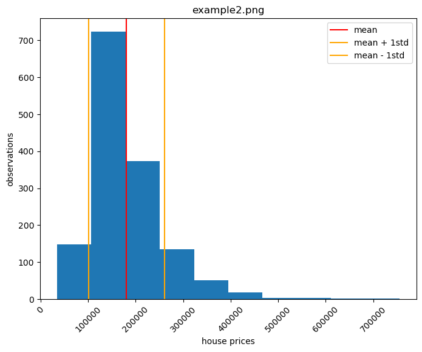
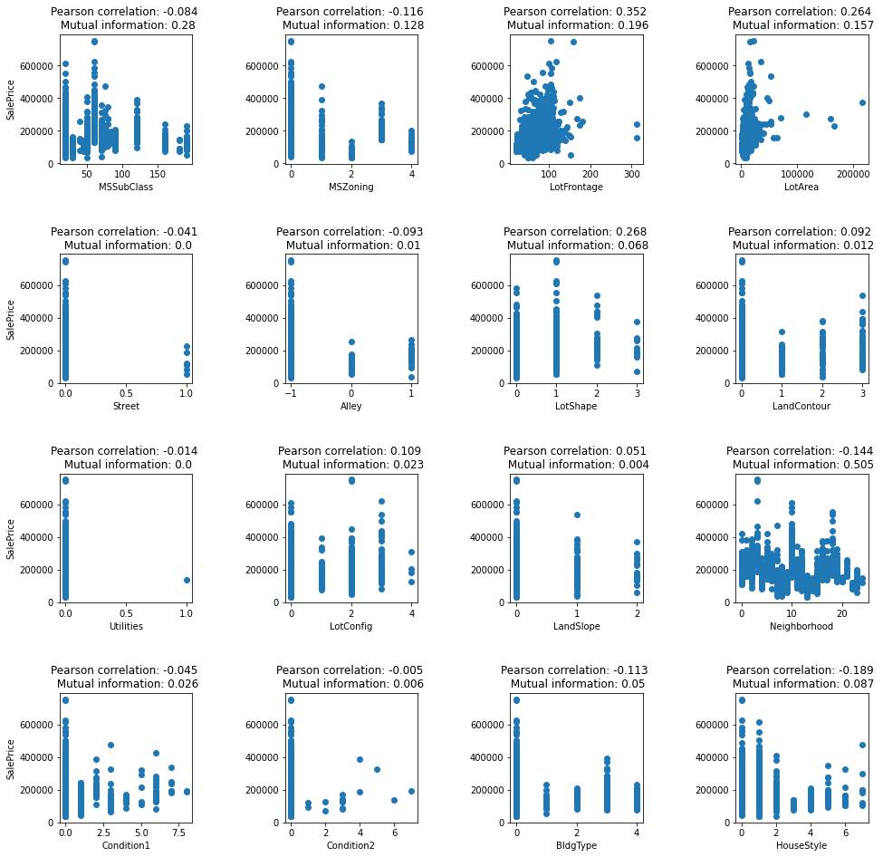
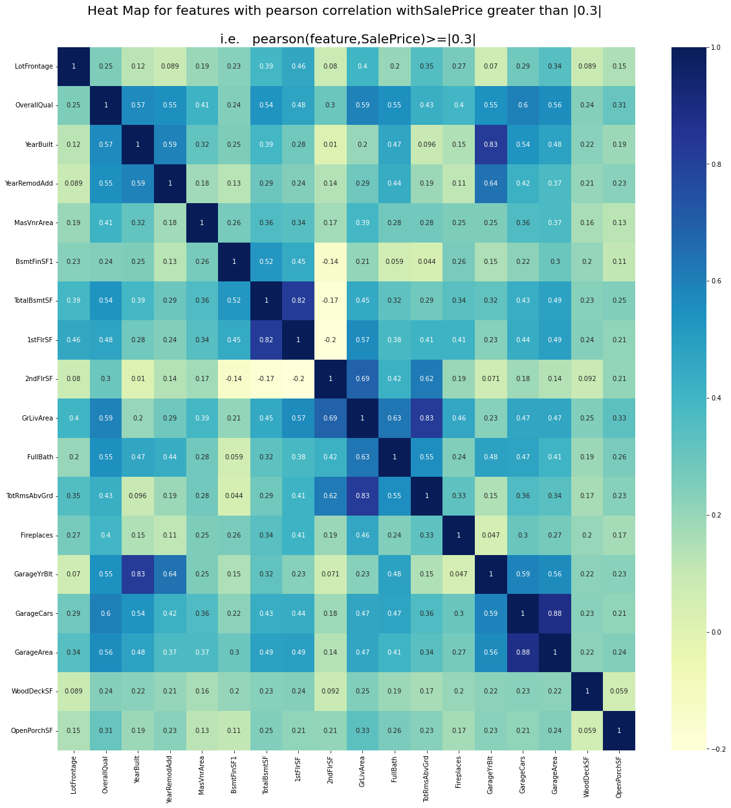

# Exploratory Data Analysis

<a href="https://github.com/JoeGanser/teaching/blob/main/Lectures/Statistics_with_Python/Exploring_Data/eda.ipynb">Notebook github link</a>

### Load our data: Housing data set, with house prices


```python
import pandas as pd
from sklearn.datasets import fetch_openml
housing = fetch_openml(name="house_prices", as_frame=True)
X = pd.DataFrame(housing.data, columns=housing.feature_names)
X.drop('Id',axis=1,inplace=True)
y = housing.target
X.head()
```


| MSSubClass | MSZoning | LotFrontage | LotArea | Street  | Alley | LotShape | LandContour | Utilities | LotConfig | ...    | ScreenPorch | PoolArea | PoolQC | Fence | MiscFeature | MiscVal | MoSold | YrSold | SaleType | SaleCondition |
|------------|----------|-------------|---------|---------|-------|----------|-------------|-----------|-----------|--------|-------------|----------|--------|-------|-------------|---------|--------|--------|----------|---------------|
| 0          | 60.0     | RL          | 65.0    | 8450.0  | Pave  | None     | Reg         | Lvl       | AllPub    | Inside | ...         | 0.0      | 0.0    | None  | None        | None    | 0.0    | 2.0    | 2008.0   | WD            | Normal  |
| 1          | 20.0     | RL          | 80.0    | 9600.0  | Pave  | None     | Reg         | Lvl       | AllPub    | FR2    | ...         | 0.0      | 0.0    | None  | None        | None    | 0.0    | 5.0    | 2007.0   | WD            | Normal  |
| 2          | 60.0     | RL          | 68.0    | 11250.0 | Pave  | None     | IR1         | Lvl       | AllPub    | Inside | ...         | 0.0      | 0.0    | None  | None        | None    | 0.0    | 9.0    | 2008.0   | WD            | Normal  |
| 3          | 70.0     | RL          | 60.0    | 9550.0  | Pave  | None     | IR1         | Lvl       | AllPub    | Corner | ...         | 0.0      | 0.0    | None  | None        | None    | 0.0    | 2.0    | 2006.0   | WD            | Abnorml |
| 4          | 60.0     | RL          | 84.0    | 14260.0 | Pave  | None     | IR1         | Lvl       | AllPub    | FR2    | ...         | 0.0      | 0.0    | None  | None        | None    | 0.0    | 12.0   | 2008.0   | WD            | Normal  |


### Example 1: Dataframe evaluation

* Demonstrate size of the data set (rows, columns)
* Identify the numerical columns
* Identify the categorical columns
* Identify the number of unique categories in the feature `SaleCondition`
    * Put these into dummy columns


```python
print(X.shape)
```

    (1460, 79)


```python
numerical_columns = [j for j in X.columns if X[j].dtype in [float,int]]
X[numerical_columns].head()
```


| MSSubClass | LotFrontage | LotArea | OverallQual | OverallCond | YearBuilt | YearRemodAdd | MasVnrArea | BsmtFinSF1 | BsmtFinSF2 | ... | GarageArea | WoodDeckSF | OpenPorchSF | EnclosedPorch | 3SsnPorch | ScreenPorch | PoolArea | MiscVal | MoSold | YrSold |
|------------|-------------|---------|-------------|-------------|-----------|--------------|------------|------------|------------|-----|------------|------------|-------------|---------------|-----------|-------------|----------|---------|--------|--------|
| 0          | 60.0        | 65.0    | 8450.0      | 7.0         | 5.0       | 2003.0       | 2003.0     | 196.0      | 706.0      | 0.0 | ...        | 548.0      | 0.0         | 61.0          | 0.0       | 0.0         | 0.0      | 0.0     | 0.0    | 2.0    | 2008.0 |
| 1          | 20.0        | 80.0    | 9600.0      | 6.0         | 8.0       | 1976.0       | 1976.0     | 0.0        | 978.0      | 0.0 | ...        | 460.0      | 298.0       | 0.0           | 0.0       | 0.0         | 0.0      | 0.0     | 0.0    | 5.0    | 2007.0 |
| 2          | 60.0        | 68.0    | 11250.0     | 7.0         | 5.0       | 2001.0       | 2002.0     | 162.0      | 486.0      | 0.0 | ...        | 608.0      | 0.0         | 42.0          | 0.0       | 0.0         | 0.0      | 0.0     | 0.0    | 9.0    | 2008.0 |
| 3          | 70.0        | 60.0    | 9550.0      | 7.0         | 5.0       | 1915.0       | 1970.0     | 0.0        | 216.0      | 0.0 | ...        | 642.0      | 0.0         | 35.0          | 272.0     | 0.0         | 0.0      | 0.0     | 0.0    | 2.0    | 2006.0 |
| 4          | 60.0        | 84.0    | 14260.0     | 8.0         | 5.0       | 2000.0       | 2000.0     | 350.0      | 655.0      | 0.0 | ...        | 836.0      | 192.0       | 84.0          | 0.0       | 0.0         | 0.0      | 0.0     | 0.0    | 12.0   | 2008.0 |


```python
categorical_columns = [j for j in X.columns if j not in numerical_columns]
X[categorical_columns].head()
```


| MSZoning | Street | Alley | LotShape | LandContour | Utilities | LotConfig | LandSlope | Neighborhood | Condition1 | ...   | GarageType | GarageFinish | GarageQual | GarageCond | PavedDrive | PoolQC | Fence | MiscFeature | SaleType | SaleCondition |
|----------|--------|-------|----------|-------------|-----------|-----------|-----------|--------------|------------|-------|------------|--------------|------------|------------|------------|--------|-------|-------------|----------|---------------|
| 0        | RL     | Pave  | None     | Reg         | Lvl       | AllPub    | Inside    | Gtl          | CollgCr    | Norm  | ...        | Attchd       | RFn        | TA         | TA         | Y      | None  | None        | None     | WD            | Normal  |
| 1        | RL     | Pave  | None     | Reg         | Lvl       | AllPub    | FR2       | Gtl          | Veenker    | Feedr | ...        | Attchd       | RFn        | TA         | TA         | Y      | None  | None        | None     | WD            | Normal  |
| 2        | RL     | Pave  | None     | IR1         | Lvl       | AllPub    | Inside    | Gtl          | CollgCr    | Norm  | ...        | Attchd       | RFn        | TA         | TA         | Y      | None  | None        | None     | WD            | Normal  |
| 3        | RL     | Pave  | None     | IR1         | Lvl       | AllPub    | Corner    | Gtl          | Crawfor    | Norm  | ...        | Detchd       | Unf        | TA         | TA         | Y      | None  | None        | None     | WD            | Abnorml |
| 4        | RL     | Pave  | None     | IR1         | Lvl       | AllPub    | FR2       | Gtl          | NoRidge    | Norm  | ...        | Attchd       | RFn        | TA         | TA         | Y      | None  | None        | None     | WD            | Normal  |

<p>5 rows × 43 columns</p>


```python
print(X['SaleCondition'].describe(),'\n')
print(X['SaleCondition'].unique())
X['SaleCondition'].head()
```

    count       1460
    unique         6
    top       Normal
    freq        1198
    Name: SaleCondition, dtype: object 
    
    ['Normal' 'Abnorml' 'Partial' 'AdjLand' 'Alloca' 'Family']

    0     Normal
    1     Normal
    2     Normal
    3    Abnorml
    4     Normal
    Name: SaleCondition, dtype: object


```python
pd.get_dummies(X['SaleCondition'])
```


| Abnorml | AdjLand | Alloca | Family | Normal | Partial |
|---------|---------|--------|--------|--------|---------|
| 0       | 0       | 0      | 0      | 0      | 1       | 0   |
| 1       | 0       | 0      | 0      | 0      | 1       | 0   |
| 2       | 0       | 0      | 0      | 0      | 1       | 0   |
| 3       | 1       | 0      | 0      | 0      | 0       | 0   |
| 4       | 0       | 0      | 0      | 0      | 1       | 0   |
| ...     | ...     | ...    | ...    | ...    | ...     | ... |
| 1455    | 0       | 0      | 0      | 0      | 1       | 0   |
| 1456    | 0       | 0      | 0      | 0      | 1       | 0   |
| 1457    | 0       | 0      | 0      | 0      | 1       | 0   |
| 1458    | 0       | 0      | 0      | 0      | 1       | 0   |
| 1459    | 0       | 0      | 0      | 0      | 1       | 0   |

<p>1460 rows × 6 columns</p>


### Example 2: House Price histograms
* Include a vertical bars indicating the mean price
* Include vertical bars indicating the mean minus and plus 1 standard deviation


```python
import matplotlib.pyplot as plt
plt.figure(figsize=(8,6))
plt.hist(y)
plt.xticks(rotation=45)
plt.title('example2.png')
plt.xlabel('house prices')
plt.ylabel('observations')
plt.axvline(y.mean(),c='red',label='mean')
plt.axvline(y.mean()+y.std(),c='orange',label='mean + 1std')
plt.axvline(y.mean()-y.std(),c='orange',label='mean - 1std')
plt.legend()
plt.savefig('example2.png')
plt.show()
```


    

    


### Example 3: Beeswarm plots

`categorical_features = ['Exterior1st','Exterior2nd','ExterQual','ExterCond']`


```python
import seaborn as sns
import warnings
warnings.filterwarnings('ignore')
n=1
categorical_features = ['Exterior1st','Exterior2nd','ExterQual','ExterCond']
plt.subplots(figsize=(15,15))
for col in categorical_features:
    plt.subplot(len(categorical_features),1,n)
    plt.ylabel('SalePrice')
    sns.swarmplot(x=col,y='SalePrice',data=pd.concat([X,y],axis=1))
    n=n+1
plt.subplots_adjust(hspace=0.3)
plt.savefig('example3.png')
plt.show()
```


    

    


### Example 4: Feature Pearson Correlation

Find the pearson correlation coefficient for all the numerical features, as compared to the target variable `SalePrice`. Sort them in a dataframe


```python
from scipy.stats import pearsonr
numerical_columns = [j for j in X.columns if X[j].dtype in [float,int]]
coefs = {}
for col in numerical_columns:
    _ = pd.concat([X[col],y],axis=1).dropna()
    pearson_coef = round(pearsonr(_[col],_['SalePrice'])[0],3)
    coefs[col] = [pearson_coef]
coefficients = pd.DataFrame(coefs).transpose().sort_values(by=0,ascending=False)
coefficients.columns = ['Pearson correlation coefficient']
coefficients
```


| Feature|Pearson coefficient|
|---------------------------------|--------|
| OverallQual                     | 0.791  |
| GrLivArea                       | 0.709  |
| GarageCars                      | 0.640  |
| GarageArea                      | 0.623  |
| TotalBsmtSF                     | 0.614  |
| 1stFlrSF                        | 0.606  |
| FullBath                        | 0.561  |
| TotRmsAbvGrd                    | 0.534  |
| YearBuilt                       | 0.523  |
| YearRemodAdd                    | 0.507  |
| GarageYrBlt                     | 0.486  |
| MasVnrArea                      | 0.477  |
| Fireplaces                      | 0.467  |
| BsmtFinSF1                      | 0.386  |
| LotFrontage                     | 0.352  |
| WoodDeckSF                      | 0.324  |
| 2ndFlrSF                        | 0.319  |
| OpenPorchSF                     | 0.316  |
| HalfBath                        | 0.284  |
| LotArea                         | 0.264  |
| BsmtFullBath                    | 0.227  |
| BsmtUnfSF                       | 0.214  |
| BedroomAbvGr                    | 0.168  |
| ScreenPorch                     | 0.111  |
| PoolArea                        | 0.092  |
| MoSold                          | 0.046  |
| 3SsnPorch                       | 0.045  |
| BsmtFinSF2                      | -0.011 |
| BsmtHalfBath                    | -0.017 |
| MiscVal                         | -0.021 |
| LowQualFinSF                    | -0.026 |
| YrSold                          | -0.029 |
| OverallCond                     | -0.078 |
| MSSubClass                      | -0.084 |
| EnclosedPorch                   | -0.129 |
| KitchenAbvGr                    | -0.136 |


### Example 5: Feature Mutual Information
Join the previous data frame with the mutual information between the target `SalePrice` and the associated numerical feature.


```python
import numpy as np
from sklearn.feature_selection import mutual_info_regression
mir = mutual_info_regression(X[numerical_columns].fillna(X[numerical_columns].mean()),y)
mir = pd.DataFrame(mir)
mir.index = numerical_columns
coefficients['mutual_information'] = mir.apply(lambda x: round(x,3))
coefficients
```


| Feature | mutual_information |pearson correlation coefficient|
|---------------------------------|--------------------|-------|
| OverallQual                     | 0.791              | 0.563 |
| GrLivArea                       | 0.709              | 0.483 |
| GarageCars                      | 0.640              | 0.357 |
| GarageArea                      | 0.623              | 0.366 |
| TotalBsmtSF                     | 0.614              | 0.366 |
| 1stFlrSF                        | 0.606              | 0.309 |
| FullBath                        | 0.561              | 0.258 |
| TotRmsAbvGrd                    | 0.534              | 0.224 |
| YearBuilt                       | 0.523              | 0.366 |
| YearRemodAdd                    | 0.507              | 0.246 |
| GarageYrBlt                     | 0.486              | 0.295 |
| MasVnrArea                      | 0.477              | 0.098 |
| Fireplaces                      | 0.467              | 0.167 |
| BsmtFinSF1                      | 0.386              | 0.145 |
| LotFrontage                     | 0.352              | 0.197 |
| WoodDeckSF                      | 0.324              | 0.105 |
| 2ndFlrSF                        | 0.319              | 0.199 |
| OpenPorchSF                     | 0.316              | 0.149 |
| HalfBath                        | 0.284              | 0.077 |
| LotArea                         | 0.264              | 0.156 |
| BsmtFullBath                    | 0.227              | 0.017 |
| BsmtUnfSF                       | 0.214              | 0.121 |
| BedroomAbvGr                    | 0.168              | 0.072 |
| ScreenPorch                     | 0.111              | 0.024 |
| PoolArea                        | 0.092              | 0.000 |
| MoSold                          | 0.046              | 0.000 |
| 3SsnPorch                       | 0.045              | 0.005 |
| BsmtFinSF2                      | -0.011             | 0.002 |
| BsmtHalfBath                    | -0.017             | 0.003 |
| MiscVal                         | -0.021             | 0.006 |
| LowQualFinSF                    | -0.026             | 0.014 |
| YrSold                          | -0.029             | 0.007 |
| OverallCond                     | -0.078             | 0.124 |
| MSSubClass                      | -0.084             | 0.275 |
| EnclosedPorch                   | -0.129             | 0.036 |
| KitchenAbvGr                    | -0.136             | 0.029 |


### Example 6: Numerical features vs sale price
**Make a scatter plot of numerical columns versus the sale price.**
    * Include the Pearson correlation and mutual information in the title for each plot
    * Do this for 16 of the numerical features
    * Plot should be 4x4, as seen below.
    


```python
n_numerical_features = 16
n=1
plt.figure(figsize=(16,16))
for col in numerical_columns[:16]:
    plt.subplot(4,4,n)
    plt.scatter(X[col],y)
    plt.xlabel(col)
    if (n-1)%4==0:
        plt.ylabel('SalePrice')
    pearson_coef = coefficients.loc[col]['Pearson correlation coefficient']    
    mutual_info = coefficients.loc[col]['mutual_information']
    plt.title('Pearson correlation: {} \n Mutual information: {}'.format(pearson_coef,mutual_info))
    n=n+1
plt.subplots_adjust(hspace=0.7,wspace=0.7)
plt.savefig('example5.png')
plt.show()
```


    

    


### Example 7: Heatmap evaluation

** Make a heat map to describe the mutual correlation (pearson correlation coefficient) of the features that had a correlation coefficient with the target price greater than |+-0.3|.**


```python
from seaborn import heatmap
import numpy as np
from scipy.stats import pearsonr
numerical_columns = [j for j in X.columns if X[j].dtype in [float,int]]
relevant_numerical = []
for col in numerical_columns:
    _ = pd.concat([X[col],y],axis=1).dropna()
    coef = round(pearsonr(_[col],_['SalePrice'])[0],3)
    if np.abs(coef)>0.3:
        relevant_numerical.append(col)

num_corr = X[relevant_numerical].corr()
plt.figure(figsize=(20,20))
heatmap(num_corr, cmap="YlGnBu", annot=True)
plt.title('Heat Map for features with pearson correlation withSalePrice greater than |0.3| \n\n i.e.   pearson(feature,SalePrice)>=|0.3|',fontsize=20)
plt.savefig('example6.png')
plt.show()
```


    

    


### Example 8: Line plot the prices


```python
import numpy as np
import matplotlib.pyplot as plt
val = 0. # this is the value where you want the data to appear on the y-axis.
ar = np.arange(10) # just as an example array

plt.scatter(y, np.zeros_like(y) + val,marker='x',c='red')
plt.scatter(y.mean(),0,label='mean',s=200)
plt.scatter(y.mean()+y.std(),0,label='mean + 1std',marker='D',s=200,color='green')
plt.scatter(y.mean()-y.std(),0,label='mean - 1std',marker='D',s=200,color='green')

ax = plt.gca()
ax.axes.yaxis.set_ticks([])
plt.legend()
plt.show()
```


    
