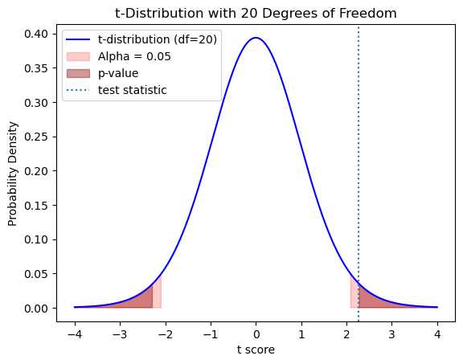

# Hypothesis Testing with Python

* <a href="https://github.com/JoeGanser/teaching/blob/main/MasterSchool/hypothesis_testing_solutions.ipynb">Github Notebook link</a>
* <a href="mailto:joeganserlectures@gmail.com">By Joe Ganser</a>

### Exercise 1: t-test degrees of freedom

Using the formula below (which applies to t-tests with unequal degrees of freedom), create a python function that performs this calculation


* s1 = standard deviation of sample 1

* n1 = sample 1 size

Calculate the degrees of freedom for:

* s1 = 5.32, n1 = 10
* s2 = 7.03, n2 = 12


```python
def degrees_of_freedom_t_test(s1,n1,s2,n2):
    s1n1 = (s1**2)/n1
    s2n2 = (s2**2)/n2
    top = (s1n1+s2n2)**2
    bottom = ((s1n1)**2)/(n1-1) + ((s2n2)**2)/(n2-1)
    return top/bottom

degrees_of_freedom_t_test(5.32,10,7.03,12)
```


    19.853795244472487


### Exercise 2: Perform a two sample t-test

Create a python function performs a two sample t-test of unequal variances. Use your result from problem 1 to calculate the degrees of freedom. The function arguments should be;

* sample_mean1
* sample_mean2
* sample_std1 (standard deviation)
* sample_std2
* n1 (sample 1 size)
* n2
* tails (the number of tails for the test)
* alpha (the significance level)

Make the function print the;

* p_value
* test statistic
* critical value
* alpha

Make the function `return` one of two conclusions;

* `Reject null hypothesis` (if `p_value < alpha` and `|test_statistic|>|critical_value|`)
* Otherwise, `Fail to reject null hypothesis`

**RECALL**

We calculate the `test_statistic` by;


**HINTS**

* `p_value` can be calculated using `(1 - t.cdf(abs(t_statistic), df))` *FOR EACH TAIL*
* `critical_value` can be calculate using `t.ppf(1 - alpha / tails, df)`

Run this function for the following values (from lecture notes):

* sample_mean1 = 22.29
* sample_mean2 = 16.3
* sample_std1 = 5.32
* sample_std2 = 7.03
* n1 = 10
* n2 = 12
* tails = 2
* alpha = 0.05


```python
from scipy.stats import t

def calculate_t_test(sample_mean1, sample_mean2, sample_std1, sample_std2, n1, n2, tails,alpha):
    # Calculate the t-statistic
    df = round(degrees_of_freedom_t_test(sample_std1,n1,sample_std2,n2))
    standard_error = ((sample_std1 ** 2) / n1 + (sample_std2 ** 2) / n2) ** 0.5
    test_statistic = (sample_mean1 - sample_mean2) / (standard_error)

    # Calculate the p-value
    p_value = tails*(1 - t.cdf(abs(test_statistic), df))

    # Calculate the critical value
    critical_value = t.ppf(1 - alpha / tails, df)
    
    print('p_value: {}'.format(p_value))
    print('critical_value: {}'.format(critical_value))
    print('test_statistic: {}'.format(test_statistic))
    print('Significance level alpha: {}'.format(alpha))
    
    if p_value<=alpha:
        if critical_value<0 and test_statistic<critical_value:
            return "Reject Null Hypothesis"
        elif critical_value>0 and test_statistic>critical_value:
            return "Reject Null Hypothesis"
    else:
        return "Fail to Reject Null Hypothesis"
    
calculate_t_test(22.29, 16.3, 5.32, 7.03, 10, 12, tails=2,alpha=0.05)
```

    p_value: 0.03425038740869879
    critical_value: 2.0859634472658364
    test_statistic: 2.2723574890239813
    Significance level alpha: 0.05


    'Reject Null Hypothesis'


### Exercise 3: Plotting a t-distribution

Using `matplotlib` make a plot of the t-distribution for `20` degrees of freedom.

* Define the horizontal values using `x = np.linspace(-4,4,500)`
* Define the vertical values using `t.pdf(horizontal_values, degrees of freedom)`
* Use the `plt.plot(horizontal_values, vertical_values, label = ....)` to plot the graph
* Give the horizontal axis a label `t-score`
* Give the vertical axis a label `Probability density`
* Make a vertical line for the test statistic using `plt.axviline(test_statistic,linestyle=':',label='test_statistic')`
* Give it a legend using the `plt.legend()` function
* Shade the tails using the following;
    * **alpha:** `plt.fill_between(x, pdf, where=(x < -critical_value) | (x > critical_value),...)` give it the color red and an alpha (transparency parameter) value of 0.2 and label of `alpha = 0.05`
    * **p-value:** `plt.fill_between(x, pdf, where=abs(x) > test_statistic, color='darkred',...)` transparency parameter= 0.4 and label `p_value`
* Show the plot


```python
import numpy as np
import matplotlib.pyplot as plt
from scipy.stats import t

# Set the degrees of freedom
df = 20

# Set the range of x-values
x = np.linspace(-4, 4, 500)

# Compute the probability density function (PDF) for the t-distribution
pdf = t.pdf(x, df)

# Create the plot
plt.plot(x, pdf, 'b-', label='t-distribution (df=20)')

# Compute the critical values for alpha = 0.05 (two-tailed test)
alpha = 0.05
critical_value = t.ppf(1 - alpha/2, df)

test_statistic = 2.272

# Shade the critical regions
plt.fill_between(x, pdf, where=(x < -critical_value) | (x > critical_value), color='red', alpha=0.2, label='Alpha = 0.05')
plt.fill_between(x, pdf, where=abs(x) > test_statistic, color='darkred', alpha=0.4,label='p-value')
# Add labels and a legend
plt.xlabel('t score')
plt.ylabel('Probability Density')
plt.title('t-Distribution with 20 Degrees of Freedom')
plt.axvline(test_statistic,linestyle=':',label='test statistic')
plt.legend()
# Display the plot
plt.show()
```


    

    


### Exercise 4: Chi2 distribution

Using the observations from the lecture slides;

                          [[60, 40, 30]
                           [80, 70, 50]
                           [70, 90, 40]]
                           
* Perform a chi2 test using the `chi2_contingency()` function from the `scipy.stats` package
* Let `alpha=0.05`
* Find the `critical_value` using `chi2.ppf(1 - alpha, df)` from function from `scipy.stats`

* Print `Reject the null hypothesis` if `p_value<=alpha` & `test_statistic>critical_value`
* Otherwise, `Fail to reject null hypothesis`


```python
from scipy.stats import chi2_contingency,chi2

# Observed frequencies (contingency table)
alpha = 0.05
observed_freq = np.array([[60, 40, 30],
                          [80, 70, 50],
                          [70, 90, 40]])

# Perform chi-square test of independence
test_statistic, p_value, df, expected_freq = chi2_contingency(observed_freq)
critical_value = chi2.ppf(1 - alpha, df)

# Print the chi-square test statistic, degrees of freedom, and p-value
print("Chi-square statistic:", test_statistic)
print("Degrees of freedom:", dof)
print("p-value:", p_value)
print('alpha:',alpha)
print('critical_value:',critical_value)

if p_value<=alpha and test_statistic>critical_value:
    print("Reject Null hypothesis")
else:
    print("Fail to reject null hypothesis")
```

    Chi-square statistic: 8.469322344322341
    Degrees of freedom: 4
    p-value: 0.07582258667376501
    alpha: 0.05
    critical_value: 9.487729036781154
    Fail to reject null hypothesis


```python

```
