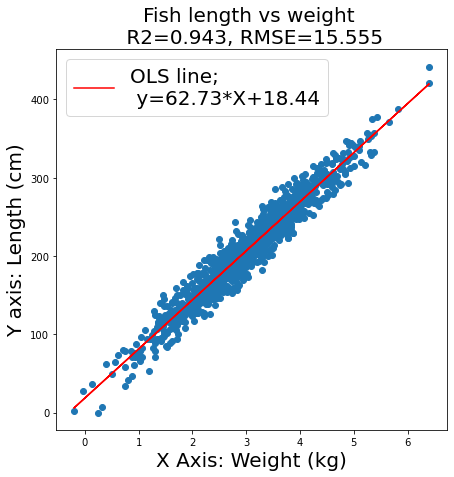
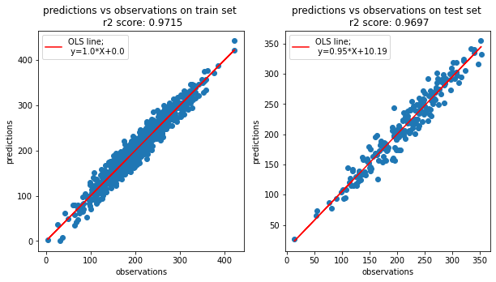
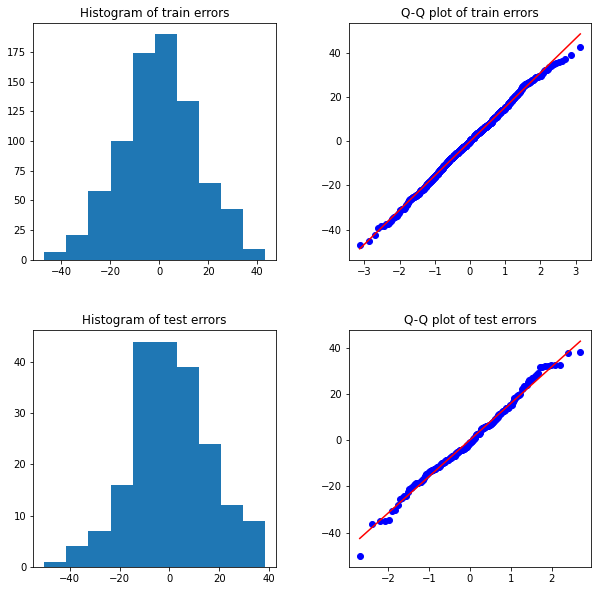

# Regression part 1

By Joe Ganser

<a href="https://github.com/JoeGanser/teaching/blob/main/Lectures/supervised_learning/regression1/Regression_part1.ipynb">Github Repo Link</a>

### Plotting Regression

A typical ordinary least squares plot graphic;

    * Y vs X
    * The function for the line of Y
    * R2 score
    * MSE value
    * Axis labels
    
**<a href="https://github.com/JoeGanser/teaching/blob/main/Lectures/supervised_learning/regression1/Example1_fish_length.py">See the attached python file to see how to plot this example</a>**

??? note "make_figure.py"
    ```py linenums="1"
    import matplotlib.pyplot as plt
    from sklearn.datasets import make_regression
    from scipy import stats
    from sklearn.metrics import r2_score,mean_squared_error

    X,y = make_regression(n_samples=1000, n_features=1, n_informative=1, n_targets=1,noise=15,bias=0)
    X = X+3
    y = y+200
    plt.figure(figsize=(7,7))
    plt.scatter(X,y)
    slope, intercept, r_value, p_value, std_err = stats.linregress(X.reshape(1,-1),y)
    line = slope*X+intercept
    if intercept>0:
        plusminus='+'
    elif intercept<0:
        plusminus=' '
    plt.plot(X,line,color='red',label='OLS line;\n y={0}*X{1}{2}'.format(round(slope,2),plusminus,round(intercept,2)))
    r2 = round(r2_score(y,line),3)
    mse = round(mean_squared_error(y,line),3)
    plt.title('Fish length vs weight \n R2={}, MSE={}'.format(r2,mse),fontsize=20)
    plt.ylabel('Y axis: Length (cm)',fontsize=20)
    plt.xlabel('X Axis: Weight (kg)',fontsize=20)
    plt.legend(fontsize=20)
    plt.savefig('fish_length_weight.png')
    plt.show()
    ```


### Example 1: Plotting Regression

**Using the following saved data to make the plot above**

`import pandas as pd
df = pd.read_csv('example1_fish_weight.csv')
X = df['weight(kg)']
y = df['length(cm)']`

* Use the `scipy.stats.linregress` method for producing the ordinary least squares line
* get the `r2_score`, `mean_squared_error` to find the `r2` and `rmse` metrics
* plot the `OLS` line


```python
import matplotlib.pyplot as plt
import pandas as pd
from scipy import stats
from sklearn.metrics import r2_score, mean_squared_error
import numpy as np
import pandas as pd
df = pd.read_csv('example1_fish_weight.csv')
X = df['weight(kg)']
y = df['length(cm)']
plt.figure(figsize=(7,7))
plt.scatter(X,y)
slope, intercept, r_value, p_value, std_err = stats.linregress(X,y)
line = slope*X+intercept
plt.plot(X,line,color='red',label='OLS line;\n y={0}*X+{1}'.format(round(slope,2),round(intercept,2)))
r2 = round(r2_score(y,line),3)
rmse = round(np.sqrt(mean_squared_error(y,line)),3)
plt.title('Fish length vs weight \n R2={}, RMSE={}'.format(r2,rmse),fontsize=20)
plt.ylabel('Y axis: Length (cm)',fontsize=20)
plt.xlabel('X Axis: Weight (kg)',fontsize=20)
plt.legend(fontsize=20)
plt.show()
```


    

    


### Example 2: Regression on train test split

**Repeating example 1, but this time performing a train-test split and using `LinearRegression` from `sklearn.linear_model`**

* For the train and test set, print
    * `r2_test`, `r2_train`
    * `rmse_test`, `rmse_train`
    
* from the `LinearRegression` model, print the;
    * slope value of OLS using `.coef_` attribute
    * intercept value using `.intercept_` attribute
    
    
**output should look like this**

`
r2_train:  0.94
rmse_train:  15.523
r2_test:  0.94
rmse_test:  15.745
slope:  [63.37004067]
intercept:  16.582701899567525
`


```python
from sklearn.linear_model import LinearRegression
from sklearn.model_selection import train_test_split
from sklearn.metrics import r2_score, mean_squared_error

X_train,X_test,y_train,y_test = train_test_split(X,y,test_size=0.2)

X_train = np.array(X_train).reshape(X_train.shape[0],1)
X_test = np.array(X_test).reshape(X_test.shape[0],1)

ols = LinearRegression().fit(X_train,y_train)

def report(model,data,target,label):
    pred = model.predict(data)
    r2 = round(r2_score(pred,target),3)
    rmse = round(np.sqrt(mean_squared_error(pred,target)),3)
    print('r2_{}: '.format(label),r2)
    print('rmse_{}: '.format(label),rmse)
    
report(ols,X_train,y_train,'train')
report(ols,X_test,y_test,'test')

print('slope: ',ols.coef_)
print('intercept: ',ols.intercept_)
```

    r2_train:  0.94
    rmse_train:  15.523
    r2_test:  0.94
    rmse_test:  15.745
    slope:  [63.37004067]
    intercept:  16.582701899567525


### Example 3: Plotting Predictions versus Observations

**Develop a scatter plot of the predictions versus the observations for the train set and test set to describe model performance.**
* Include the ols line equations as well as the r2 score
* Plot should look like this;
* Do we see homoskedascity?


```python
y_pred_train = ols.predict(X_train)
y_pred_test = ols.predict(X_test)

def predictions_vs_observations(observations,predictions,label):
    slope, intercept, r_value, p_value, std_err = stats.linregress(observations,predictions)
    plt.title('predictions vs observations on {0} set \n r2 score: {1}'.format(label,round(r_value,4)))
    plt.scatter(observations,predictions)
    plt.ylabel('predictions')
    plt.xlabel('observations')
    line = slope*observations+intercept
    plt.plot(observations,line,color='red',label='OLS line;\n y={0}*X+{1}'.format(round(slope,2),round(intercept,2)))
    plt.legend()

plt.figure(figsize=(10,5))
plt.subplot(1,2,1)
predictions_vs_observations(y_pred_train,y_train,'train')
plt.subplot(1,2,2)
predictions_vs_observations(y_pred_test,y_test,'test')
plt.show()
```


    

    


### Example 4: Error Histograms & QQ plots

Make a plot of the prediction errors on the train set and and the test set as seen below.
Include the histogram for the errors and q-q plot for the errors.

Are the errors normally distributed?


```python
error_train = y_pred_train-y_train
error_test = y_pred_test-y_test

def hist_qq_plot(error_train,error_test):
    plt.figure(figsize=(10,10))
    plt.subplot(2,2,1)
    plt.hist(error_train)
    plt.title('Histogram of train errors')
    plt.subplot(2,2,2)
    stats.probplot(error_train,plot=plt)
    plt.title('Q-Q plot of train errors')
    plt.xlabel('')
    plt.ylabel('')
    plt.subplot(2,2,3)
    plt.hist(error_test)
    plt.title('Histogram of test errors')
    plt.subplot(2,2,4)
    stats.probplot(error_test,plot=plt)
    plt.title('Q-Q plot of test errors')
    plt.xlabel('')
    plt.ylabel('')
    plt.subplots_adjust(wspace=0.3,hspace=0.3)
    plt.savefig('example4.png')
    plt.show()

hist_qq_plot(error_train,error_test)
```


    

    


```python

```
