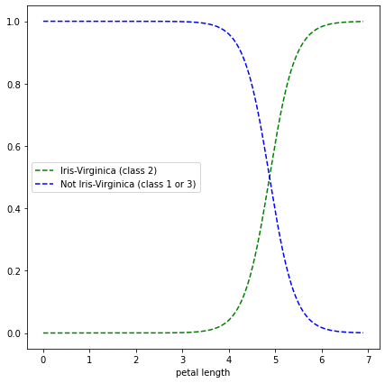

# Classification Part 1
by Joe Ganser

* <a href="https://github.com/JoeGanser/teaching/blob/main/Lectures/supervised_learning/Classification_part1.ipynb">Github repo link</a>

### Step 1: Loading our data, and examining what it looks like
* This is the famous "iris" data set from the UCI Machine learning repository.
* It describes a the flower petal width and lengths for three different flower species.
* Load the data and examine the first 5 columns
    * columns names are; `columns = ['sepal_length','sepal_width','petal_length','petal_width']`


```python
from sklearn import datasets
import pandas as pd
iris = datasets.load_iris()
columns = ['sepal_length','sepal_width','petal_length','petal_width']
X = pd.DataFrame(iris["data"],columns=columns)
y = pd.DataFrame(iris["target"],columns=['target'])
data = pd.concat([X,y],axis=1)
data.head()
```


| sepal_length | sepal_width | petal_length | petal_width | target |
|--------------|-------------|--------------|-------------|--------|
| 5.1         | 3.5          | 1.4         | 0.2    | 0 |
| 4.9         | 3.0          | 1.4         | 0.2    | 0 |
| 4.7         | 3.2          | 1.3         | 0.2    | 0 |
| 4.6         | 3.1          | 1.5         | 0.2    | 0 |
| 5.0         | 3.6          | 1.4         | 0.2    | 0 |


### Step 2: EDA
Let's get a value count of each class, to see their distribution

* Are these classes balanced?
* How many values are there for each class?


```python
data['target'].value_counts()
```

    0    50
    1    50
    2    50
    Name: target, dtype: int64


### Step 3: Simple Model

Lets fit a simple logistic regression model to the data, and see the over all accuracy score

* Load the data
    * Dont worry about train/test/split
* Instantiate the `LogisticRegression` class
* Fit the `X,y` data to it.
* Use the fitted model to make predictions
* Using the predictions, find the `accuracy_score`

**Question: Does the score mean anything if we havent split the data?**


```python
from sklearn.linear_model import LogisticRegression
from sklearn.metrics import accuracy_score
import warnings
warnings.filterwarnings('ignore')
X = data.drop('target',axis=1)
y = data['target']
log_reg = LogisticRegression(multi_class="multinomial",solver="lbfgs")
log_reg.fit(X,y)
y_pred = log_reg.predict(X)
print(accuracy_score(y,y_pred))
```

    0.9733333333333334


### Step 4: "One vs Rest classification" 

Lets re-do example 3, except this time focusing only on classifying everything as either class 2, or not. 

* This makes it a binary classification problem
* Use only the 3rd column (`petal_length`) of the data set to make predictions.
* Also, lets visualize the predicted probability of it being class 2 as a function of the petal/sepal length/width.
    * Plot the predicted probability of being class 2 versus the petal length
    * Use the `predict_proba` function on the `LogisticRegression()` function to do the calculations.
    * The petal width bounds between 0 and the max value of that feature
        * What does this mean?


```python
from sklearn import datasets
import numpy as np
import matplotlib.pyplot as plt
from sklearn.linear_model import LogisticRegression
iris = datasets.load_iris()
X = np.array(data['petal_length']).reshape(-1,1)
y = data['target'].apply(lambda x: 1 if x==2 else 0).values
log_reg = LogisticRegression()
log_reg.fit(X,y)
X_new = np.linspace(0,X.max(),1000).reshape(-1,1)
y_proba = log_reg.predict_proba(X_new)
plt.figure(figsize=(7,7))
plt.plot(X_new,y_proba[:,1],"g--",label="Iris-Virginica (class 2)")
plt.plot(X_new,y_proba[:,0],"b--",label="Not Iris-Virginica (class 1 or 3)")
plt.xlabel('petal length')
plt.legend(loc='center left')
plt.show()
```


    

    


### Step 5: Train test Split 
Split the data set into train, test and validation sets

* train set: 70% of data
* test set: 15% of data
* validation set: 15% of data


* Use an artificially generated data set;

`
from sklearn.datasets import make_classification
X,y = make_classification(n_samples=1000, n_features=20, n_informative=18, n_redundant=2, n_repeated=0, 
                          n_classes=3)`


```python
from sklearn.datasets import make_classification
X,y = make_classification(n_samples=1000, n_features=20, n_informative=18, n_redundant=2, n_repeated=0, 
                          n_classes=3)

# perform train test val split
from sklearn.model_selection import train_test_split
X_train,X_test,y_train,y_test = train_test_split(X,y,test_size=0.3)
X_test,X_val,y_test,y_val = train_test_split(X_test,y_test,test_size=0.5)
```

### Step 6: Cross Validation

Use cross validation to split our dataset into several 5 folds, and evaluate how a simple logistic regression classifier does on each fold


```python
from sklearn.datasets import make_classification
X,y = make_classification(n_samples=1000, n_features=20, n_informative=18, n_redundant=2, n_repeated=0, 
                          n_classes=3)

# perform train test val split
from sklearn.model_selection import train_test_split
X_train,X_test,y_train,y_test = train_test_split(X,y,test_size=0.3)

from sklearn.linear_model import LogisticRegression
from sklearn.model_selection import cross_val_score

cross_val_score(LogisticRegression(),X_train,y_train,cv=5)
```

    array([0.60714286, 0.70714286, 0.56428571, 0.62142857, 0.6       ])


### Step 7: Grid searching

Use grid search on the data set in example 6 to find the best value of c in the ranges of `[0.0001,0.001,0.01,0.1,1,10]`


```python
from sklearn.datasets import make_classification
X,y = make_classification(n_samples=1000, n_features=20, n_informative=18, n_redundant=2, n_repeated=0, 
                          n_classes=3)

# perform train test val split
from sklearn.model_selection import train_test_split
X_train,X_test,y_train,y_test = train_test_split(X,y,test_size=0.3)

from sklearn.linear_model import LogisticRegression
from sklearn.model_selection import GridSearchCV

parameters = {'C':[0.0001,0.001,0.01,0.1,1,10]}
gs = GridSearchCV(LogisticRegression(),parameters,cv=5)
gs.fit(X_train,y_train)
print(gs.best_score_)
print(gs.best_params_)
```

    0.6857142857142857
    {'C': 0.001}


### Step 8:  Testing hyperparameters

Using example 5 data, run through a series of hyper parameters (values of `c`) for `LogisticRegression()` and find the value of `c` that fits the best score on the train set, test set and validation set.

* `c` is the hyper parameter of `LogisticRegression()`
* Since the set had 3 classes, let the model by `LogisticRegression(multi_class="multinomial",solver="lbfgs",C=c)`
* Loop through possible values of `c`, finding the best one
    * This means we want to minimize the score difference between the *train*, *val* and *test* sets
    * At each value of `c`, save the scores values to the dictionary


```python
from sklearn.datasets import make_classification
from sklearn.model_selection import train_test_split
from sklearn.linear_model import LogisticRegression
from sklearn.metrics import accuracy_score

X,y = make_classification(n_samples=1000, n_features=20, n_informative=18, n_redundant=2, n_repeated=0, 
                          n_classes=3)
X_train,X_test,y_train,y_test = train_test_split(X,y,test_size=0.3)
X_test,X_val,y_test,y_val = train_test_split(X_test,y_test,test_size=0.5)


scores = {}
max_score = 0
min_diff = 100
for c in [0.0001,0.001,0.01,0.1,1,10]:
    log_reg = LogisticRegression(multi_class="multinomial",solver="lbfgs",C=c)
    log_reg.fit(X_train,y_train)
    y_pred = log_reg.predict(X_val)
    y_pred_train = log_reg.predict(X_train)
    train_score = accuracy_score(y_pred_train,y_train)
    val_score = accuracy_score(y_pred,y_val)
    scores[c] = (val_score,train_score,np.abs(val_score-train_score))
    if val_score>max_score:
        max_score = val_score
    if np.abs(val_score-train_score)<min_diff:
        min_diff = np.abs(val_score-train_score)
print("Best validation score: ",max_score)
c_best = [j for j in scores.keys() if scores[j][0]==max_score][0]
log_reg_best = LogisticRegression(multi_class="multinomial",solver="lbfgs",C=c_best)
log_reg_best.fit(X_train,y_train)
y_pred_test = log_reg.predict(X_test)
print("Best C value: ",c_best)
```

    Best validation score:  0.7066666666666667
    Best C value:  0.1

