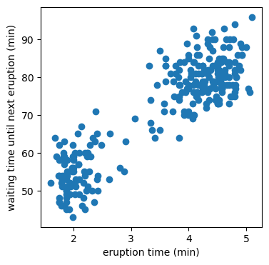
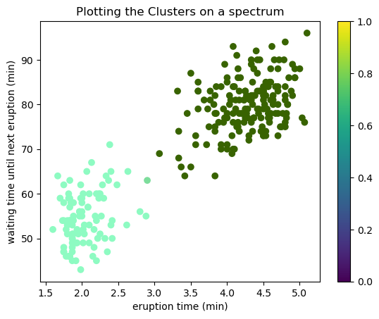
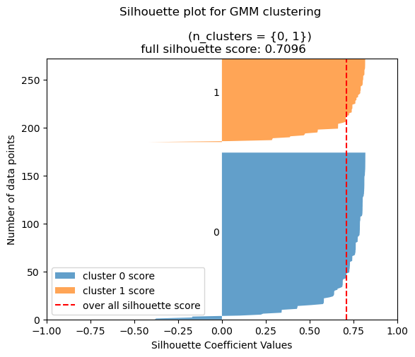

# Gaussian Mixture Models: Unsupervised Learning


<figure markdown>
  { width="200" height="200" }
</figure>

By Joe Ganser

<a href="https://github.com/JoeGanser/teaching/blob/main/Lectures/unsupervised_learning/GMM/GMM_notebook.ipynb">Link to notebook on Github</a>


### I Objective

In this tutorial, we'll be using Gaussian mixture models to describe the multimodal distributions of Geyser Eruptions. Working with lengths of eruption times and the time period until the next eruption, we can properly model the clusters in the dataset. 


### II Exploring Data
Our dataset consists of two features:

* eruptions  numeric  Eruption time in mins
* waiting    numeric  Waiting time to next eruption

<figure markdown>
  { width="200" height="200" }
</figure>


| eruptions | waiting |
|-----------|---------|
| 3.600   | 79 |
| 1.800   | 54 |
| 3.333   | 74 |
| 2.283   | 62 |
| 4.533   | 85 |


### III Visualizing Data
Using visualization techniques, we can observe how the data is distributed. This will suggest the number of clusters we can use to describe the data. We should consider

* Histograms of each feature (To observe the multi-modal property)
* Box plots
* Scatter plot of one eruption time vs waiting time

??? note "make_figure.py"
    ```py linenums="1"
      import matplotlib.pyplot as plt
      import seaborn as sns
      import numpy as np
      n = 4
      plt.figure(figsize=(2*n,n))
      plt.subplot(2,2,1)
      col = 'eruptions'
      sns.distplot(data[col],bins=int(np.sqrt(data[col].shape[0])))
      plt.ylabel('% of data')
      plt.xlabel('eruption time (min)')
      plt.subplot(2,2,2)
      plt.boxplot(data[col],vert=False)
      ####
      plt.subplot(2,2,3)
      col = 'waiting'
      sns.distplot(data[col],bins=int(np.sqrt(data[col].shape[0])))
      plt.ylabel('% of data')
      plt.xlabel('waiting time until next eruption (min)')
      plt.subplot(2,2,4)
      plt.boxplot(data[col],vert=False)
      plt.subplots_adjust(hspace=0.5)
      plt.subplots_adjust(wspace=0.25)
      plt.figure(figsize=(n,n))
      plt.scatter(data['eruptions'],data['waiting'])
      plt.xlabel('eruption time (min)')
      plt.ylabel('waiting time until next eruption (min)')
      plt.show()
    ```


    

    


    

    


### IV Estimating GMM parameters

We can see through visualization that the data has a multimodal distribution (bimodal, probably). Despite this, to properly evaluate Gaussian mixture models on the data, it's best to loop through a range of possible parameters and visualize the model performance. There are two possible parameters we evaluate;

* `covariance_type`
    * `['diag','spherical','full','tied']`
* `n` clusters
    * `range(1,11)`
    
We plot the values of the <a href="https://en.wikipedia.org/wiki/Akaike_information_criterion">Akaike information criterion (AIC)</a> as a function of the model parameters. Gaussian mixture models tell us the AIC info measure for each parameter set. A parsimoneous model is one that minimizes the AIC and simultaneously minimizes the number of clusters. This code inspired by source [2].


```python
from sklearn.mixture import GaussianMixture as GMM
import matplotlib.pyplot as plt
n_components = range(1,11)
covariances = ['diag','spherical','full','tied']
models = {c:[] for c in covariances}
for cov in covariances:
    for n in n_components:
        models[cov].append(GMM(n,covariance_type=cov,random_state=0).fit(data))

for cov in covariances:
    plt.plot(n_components, [m.aic(data) for m in models[cov]], label='{} covariance'.format(cov))

plt.legend(loc='best')
plt.ylabel('Akaike information criterion (AIC)')
plt.xlabel('number of clusters')
plt.show()
```


    

    


### V Plotting GMM clusters

We know from the plot above that `n_components=2` is the optimal number of clusters, and `covariance_type='full'` minimizes the AIC. The `.predict()` method of Gaussian mixture models predicts the cluster memmbership of each data point (row). Considering this dataset is two dimensional, we can visualize the cluster membership of each data point (row) using colors.


```python
preds = GMM(n_components=2,covariance_type='full').fit(data).predict(data)
data['cluster'] = preds
data.head()
```

 eruptions | waiting | cluster 
-----------|---------|---------
 3.600   | 79      | 0 
 1.800   | 54      | 1 
 3.333   | 74      | 0 
2.283   | 62      | 1 
 4.533   | 85      | 0 


```python
preds = GMM(n_components=2,covariance_type='full').fit(data).predict(data)
preds = ['red' if i==0 else 'blue' for i in preds]
data['cluster'] = pd.Series(preds)
cluster_colors = {'red':'cluster1','blue':'cluster2'}
for color in cluster_colors.keys():
    _ = data[data[data.columns[-1]]==color]
    plt.scatter(_['eruptions'],_['waiting'],c=color,label=cluster_colors[color])
data.drop('cluster',axis=1,inplace=True)
plt.legend()
plt.xlabel('eruption time (min)')
plt.ylabel('waiting time until next eruption (min)')
plt.show()
```


    

    


### VI Plotting GMM by density

One of the advantages of Gaussian mixture models is that it predicts each data point's probability of cluster membership. We can visualize by performing the same technique above, with the added feature of color density.


```python
pred_proba = GMM(n_components=2,covariance_type='full').fit(data).predict_proba(data)
data['cluster membership probability'] = [i for i in pred_proba]
data.head()
```


 eruptions | waiting | cluster membership probability 
-----------|---------|--------------------------------
3.600   | 79                             | [2.6846917033762443e-09, 0.9999999973153084] 
1.800   | 54                             | [0.9999999981364178, 1.8635824263855646e-09] 
3.333   | 74                             | [8.646713809338013e-06, 0.9999913532861907]  
2.283   | 62                             | [0.9999894929795239, 1.0507020476591217e-05] 
4.533   | 85                             | [1.0853706914214446e-21, 1.0]        


```python
pred_proba = GMM(n_components=2,covariance_type='full').fit(data).predict_proba(data)
# Generate two random colors
color1 = np.random.rand(3)
color2 = np.random.rand(3)
# Create an array of weights that determine the mixture of the two colors
weights = pred_proba[:,0]
# Create an array of RGB color tuples that represent the mixture of the two colors
colors = np.array([(1 - weight) * color1 + weight * color2 for weight in weights])
# Create the scatter plot with the mixed colors
plt.scatter(data['eruptions'],data['waiting'], c=colors)
# Show the plot
import matplotlib.colors as colors
cmap = colors.ListedColormap([color1,color2])

plt.colorbar(cmap=cmap)
plt.title("Plotting the Clusters on a spectrum")
plt.xlabel('eruption time (min)')
plt.ylabel('waiting time until next eruption (min)')
plt.show()
```


    

    


### VII Visualizing GMM model performance

The `silhouette_score` is a useful metric for evaluating unsupervised learning models. We can visualize the performance of each cluster, as well as the combinations of all the clusters in the data. Below, we perform a silhouette plot for the full dataset.


```python
from sklearn.metrics import silhouette_samples, silhouette_score

N_clus = 2
labels = preds = GMM(n_components=N_clus,covariance_type='full').fit(data).predict(data)
silhouette_scores = silhouette_samples(data, labels)

# Get the silhouette score for the entire dataset
overall_silhouette_score = silhouette_score(data, labels)

# Plot the silhouette scores for each cluster
fig, ax = plt.subplots()
ax.set_xlim([-1, 1])
ax.set_ylim([0, len(data)])

y_lower = 0
for i in range(N_clus):
    cluster_silhouette_scores = silhouette_scores[labels == i]
    cluster_silhouette_scores.sort()
    size_cluster_i = cluster_silhouette_scores.shape[0]
    y_upper = y_lower + size_cluster_i
    ax.fill_betweenx(np.arange(y_lower, y_upper), 0, cluster_silhouette_scores,
                      alpha=0.7, edgecolor='none',label='cluster {} score'.format(i))
    ax.text(-0.05, y_lower + 0.5 * size_cluster_i, str(i))
    y_lower = y_upper + 10

ax.axvline(x=overall_silhouette_score, color="red", linestyle="--",label='over all silhouette score')
ax.set_title('''Silhouette plot for GMM clustering \n
                (n_clusters = {}) \n full silhouette score: {}'''.format(set(labels),round(overall_silhouette_score,4)))
ax.set_xlabel("Silhouette Coefficient Values")
ax.set_ylabel("Number of data points")
plt.legend(loc='lower left')
plt.show()
```


    

    


### VIII Sources

1. (data source) https://www.stat.cmu.edu/~larry/all-of-statistics/=data/faithful.dat
2. https://jakevdp.github.io/PythonDataScienceHandbook/05.12-gaussian-mixtures.html
3. https://en.wikipedia.org/wiki/Akaike_information_criterion
4. https://scikit-learn.org/stable/auto_examples/mixture/plot_gmm_covariances.html#sphx-glr-auto-examples-mixture-plot-gmm-covariances-py
